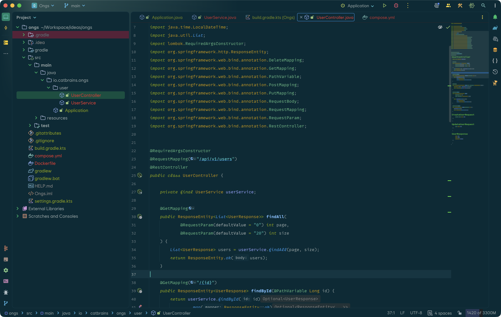

# CatBrains Islands Theme

A dark theme based on the [Solarized](https://ethanschoonover.com/solarized/) palette, built on JetBrains' latest Islands Theme architecture.

We've always preferred **Solarized** over pure black themes—it's just easier on the eyes. But when JetBrains moved to Islands, the Solarized themes we loved became deprecated and stopped receiving updates. So we built this.

If it finds its way to your screen and feels right, nothing would make us happier.

The font in the screenshots is [MonoLisa](https://www.monolisa.dev)—we love its curly, natural-looking ligatures.

Still under active development—currently testing with Java and fixing issues as we go. TypeScript, JavaScript, and Python are next on the list.

## Screenshots 📷

### Noir

### Dark

## Variants 🎨

- **Dark** — Pure Solarized colors
- **Noir** — Bolder, more vivid take

## Installation ⚙️

1. **Settings** → **Plugins** → Search "CatBrains Islands"
2. Install and restart
3. **Settings** → **Appearance** → Select theme

## Contributors 🐈

Made together with **ongs** & **mongs** 💖

## License 🔐

MIT
